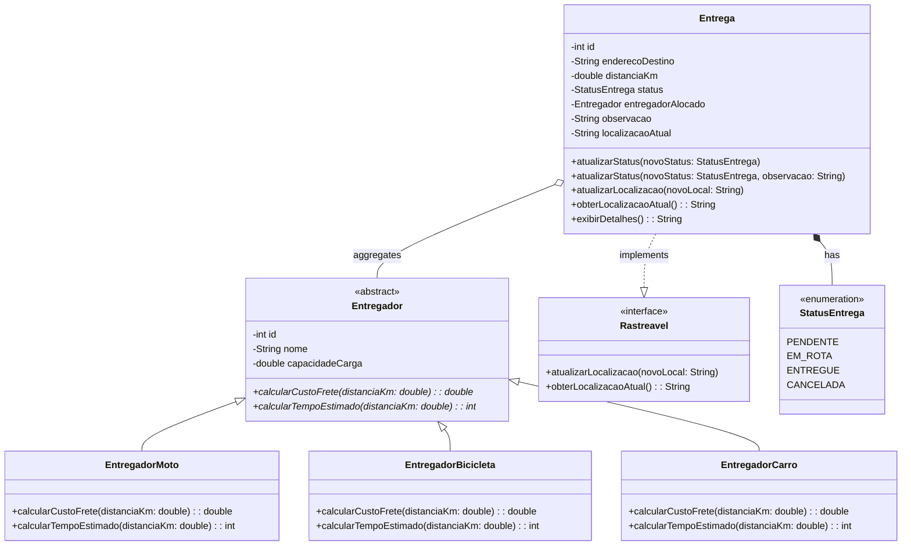

```mermaid
classDiagram
    class Entregador {
        <<abstract>>
        -int id
        -String nome
        -double capacidadeCarga
        +calcularCustoFrete(distanciaKm: double): double*
        +calcularTempoEstimado(distanciaKm: double): int*
    }

    class EntregadorMoto {
        +calcularCustoFrete(distanciaKm: double): double
        +calcularTempoEstimado(distanciaKm: double): int
    }

    class EntregadorBicicleta {
        +calcularCustoFrete(distanciaKm: double): double
        +calcularTempoEstimado(distanciaKm: double): int
    }

    class EntregadorCarro {
        +calcularCustoFrete(distanciaKm: double): double
        +calcularTempoEstimado(distanciaKm: double): int
    }

    Entregador <|-- EntregadorMoto
    Entregador <|-- EntregadorBicicleta
    Entregador <|-- EntregadorCarro

    class Rastreavel {
        <<interface>>
        +atualizarLocalizacao(novoLocal: String)
        +obterLocalizacaoAtual(): String
    }

    class Entrega {
        -int id
        -String enderecoDestino
        -double distanciaKm
        -StatusEntrega status
        -Entregador entregadorAlocado
        -String observacao
        -String localizacaoAtual
        +atualizarStatus(novoStatus: StatusEntrega)
        +atualizarStatus(novoStatus: StatusEntrega, observacao: String)
        +atualizarLocalizacao(novoLocal: String)
        +obterLocalizacaoAtual(): String
        +exibirDetalhes(): String
    }

    class StatusEntrega {
        <<enumeration>>
        PENDENTE
        EM_ROTA
        ENTREGUE
        CANCELADA
    }

    Entrega ..|> Rastreavel : implements
    Entrega *-- StatusEntrega : has
    Entrega o-- Entregador : aggregates
```
